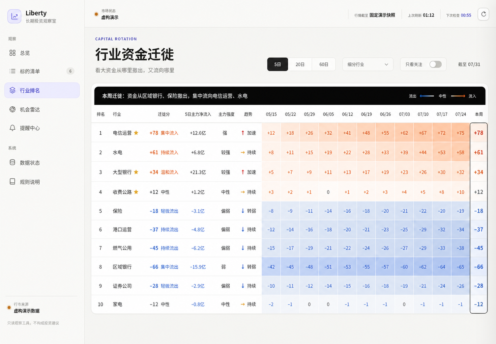

# 行业资金迁徙方案 v1

> 状态：产品与数据方案，尚未接入正式页面。

## 目标

用一张表回答三个问题：

1. 当前主力大单正集中流入哪些关注行业；
2. 哪些行业正在被持续抽走资金；
3. 最近 12 周，资金在行业之间如何迁徙。

当前网站的行业热度由 1/5/20 日收益、5 日上涨宽度和 MA20 上方比例计算，
本质上是价格动量，不是资金流。新方案将其替换为有正负方向的“资金迁徙分”。

## 计算范围

- 默认使用“细分行业”，而不是金融、工业、公用事业这类过宽的一级行业。
- 不只使用 Liberty 的 100 只观察证券。每个关注行业建立一个行业代理池：
  按近 20 日成交额选择覆盖行业成交额 80% 的高流动性成分股，至少 5 只、
  最多 20 只；成分池每月更新一次。
- A 股、H 股资金流先按交易日汇率换算成人民币，再汇总比较。
- 单只股票缺失不补 0；行业有效成交额覆盖不足 80% 时，该期单元格留空。
- 只有 1–2 个有效发行人的行业仍可展示，但标记为“低覆盖代理”，避免把单股
  资金流误称为完整行业结论。

## 基础数据

对证券 `s`、行业 `g`、观察窗口 `W`：

```text
F(s,W) = Σ 主力大单净流入(s,d) × 当日人民币汇率
T(s,W) = Σ 成交额(s,d) × 当日人民币汇率

F(g,W) = Σ F(s,W)
T(g,W) = Σ T(s,W)
I(g,W) = F(g,W) / T(g,W)
```

其中 `F` 回答“实际有多少大资金净主动买入或卖出”，`I` 回答“相对于该行业
自身交易规模，这股力量有多强”。主力大单净流入采用 Futu 历史资金流的
`main_in_flow`；成交额采用日 K 线或收盘快照的 `turnover`。

## 资金迁徙分

在同一窗口、全部被比较行业内，用 90% 分位做稳健缩放：

```text
A(g,W) = clip(F(g,W) / Q90(|F(*,W)|), -1, 1)
B(g,W) = clip(I(g,W) / Q90(|I(*,W)|), -1, 1)

Migration(g,W) = 100 × [0.70 × A(g,W) + 0.30 × B(g,W)]
```

解释：

- `+60 ~ +100`：集中流入；
- `+20 ~ +60`：持续流入；
- `-20 ~ +20`：中性；
- `-60 ~ -20`：持续流出；
- `-100 ~ -60`：集中流出。

分数保留资金流的真实正负方向：即使全市场都在流出，排名第一的行业也不会被
错误显示为“热门流入”。页面按当前选择的 5/20/60 日窗口直接排序，不再混合
多个周期形成难以解释的总分；“趋势”单独显示本窗口与前一等长窗口的分数差。

## 单表设计

- 固定左侧：排名、行业、迁徙分、主力净流入、主力强度、趋势；
- 横向历史：最近 12 个自然周的迁徙分热力格；
- 暖橙表示流入、冷蓝表示流出、灰白表示中性，本周加黑色描边；
- 用户关注行业加星并可切换“只看关注”；
- 鼠标停在历史格时显示净流入金额、主力强度、覆盖率、样本数和当周排名；
- 顶部一句话只总结本周最明显的 2 个流入行业和 2 个流出行业；
- 移动端固定“行业 + 迁徙分”，历史周格横向滑动，不拆成多张卡片。

## 数据与部署

- 新增独立的日终资金流采集器，不混入每分钟行情快照；
- 每个交易日收盘后采集资金流和成交额，原子生成
  `runtime/daily_capital_flow.json`；
- 首次回填最近一年，之后按交易日增量更新；
- 沿用现有 SSH 原子上传、只读挂载和严格数据契约；
- 页面明确标注“主力大单净流入代理，不等同于市场中存在可守恒的净新增资金”。

## 示意图


